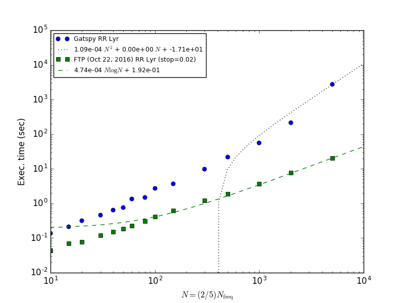
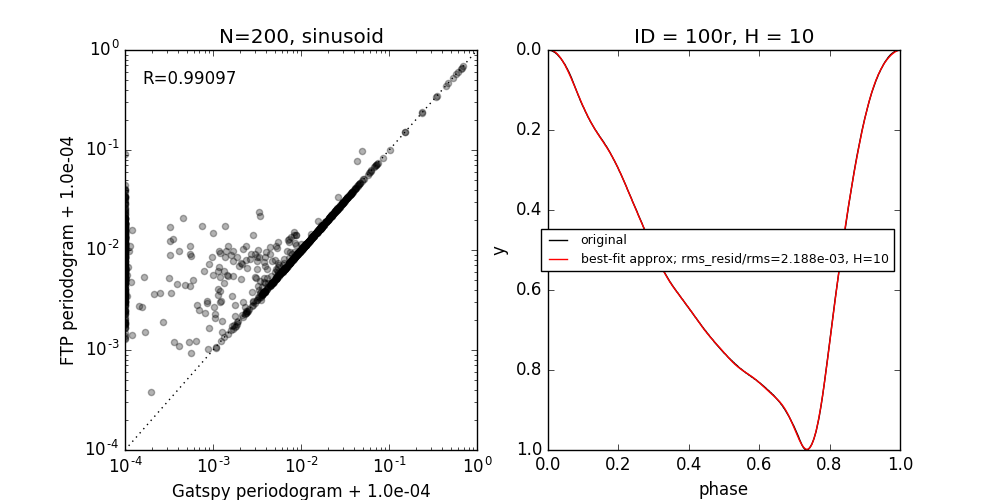
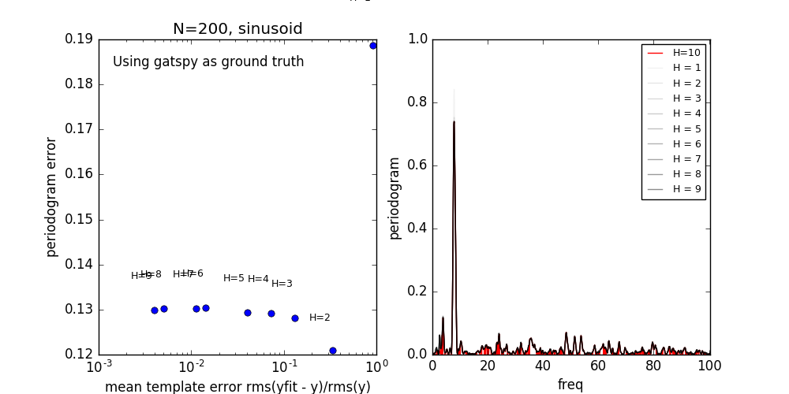
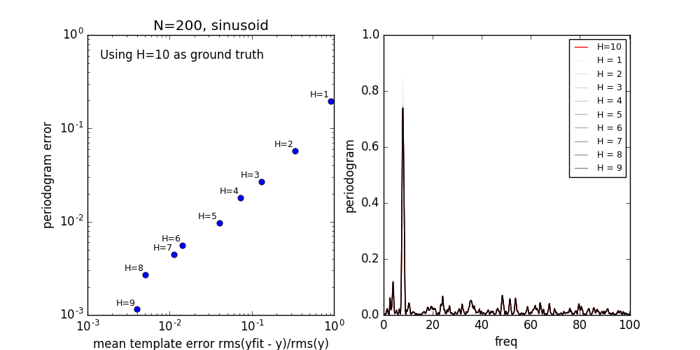

Fast Template Periodogram
=========================

John Hoffman, Jake Vanderplas
(c) 2016

Description
-----------
The Fast Template Periodogram extends the Generalised Lomb-Scargle
periodogram ([Zechmeister and Kurster 2009](http://adsabs.harvard.edu/cgi-bin/bib_query?arXiv:0901.2573])) 
for arbitrary (periodic) signal shapes. A template is first approximated
by a truncated Fourier series of length `H`. The Nonequispaced Fast Fourier Transform
[NFFT](https://www-user.tu-chemnitz.de/~potts/nfft/) is used
to efficiently compute frequency-dependent sums.

Because the FTP is a non-linear extension of the GLS, the zeros of 
a polynomial of order `~6H` must be computed at each frequency.

The [gatspy](http://www.astroml.org/gatspy/) library has an implementation of
both single and multiband template fitting, however this implementation
uses non-linear least-squares fitting to compute the optimal parameters 
(amplitude, phase, constant offset) of the template fit at each frequency. That
process scales as `N_obs*N_f`, where `N` is the number of observations and
`N_f` is the number of frequencies at which to calculate the periodogram.

This process is extremely slow. [Sesar et al. (2016)](https://arxiv.org/abs/1611.08596) applied a similar
template fitting procedure to multiband Pan-STARRS photometry and found that
(1) template fitting was signicantly more accurate for estimating periods
of RR Lyrae stars, but that (2) it required a substantial amount of 
computational resources to perform these fits.

However, if the templates are sufficiently smooth (or can be adequately 
approximated by a sufficiently smooth template) the template can be
represented by a short truncated Fourier series of length `H`. Using this 
representation, the optimal parameters (amplitude, phase, offset) 
of the template fit can then be found exactly after finding the roots of 
a polynomial at each trial frequency.

The coefficients of these polynomials involve sums that can be efficiently
computed with (non-equispaced) fast Fourier transforms. These sums
can be computed in `HN_f log(HN_f)` time.

In its current state, the root-finding procedure is the rate limiting step.
This unfortunately means that for now the fast template periodogram scales as 
`N_f*(H^4)`. We are working to reduce the computation time so that the entire 
procedure scales as `HN_f log(HN_f)` for reasonable values of `H` (`< 10`).

However, even for small cases where `H=6` and `N_obs=10`, this procedure is 
about twice as fast as the `gatspy` template modeler. And, the speedup over
`gatspy` grows linearly with `N_obs`! 


How is this different than the multi-harmonic periodogram?
----------------------------------------------------------


The multi-harmonic periodogram ([Schwarzenberg-Czerny (1996)]()) is another 
extension of Lomb-Scargle that fits a truncated Fourier series to the data 
at each trial frequency. This is nice if you have a strong non-sinusoidal signal 
and a large dataset. This algorithm can also be made to scale as
`HN_f logHN_f` ([Palmer 2009]()).

However, the multi-harmonic periodogram is fundementally different than template fitting. 
In template fitting, the relative amplitudes and phases of the Fourier series are *fixed*. 
In a multi-harmonic periodogram, the relative amplitudes and phases of the Fourier series are 
*free parameters*. These extra free parameters mean that (1) you need a larger
number of observations `N_obs` to reach the same signal to noise, and (2) you are
more likely to detect a multiple of the true frequency. For a discussion of this
effect, possible remedies with Tikhonov regularization, and an illuminating review
of periodograms in general, see [Vanderplas et al. (2015)](http://adsabs.harvard.edu/abs/2015ApJ...812...18V).

Requirements
------------

* [pyNFFT](https://pypi.python.org/pypi/pyNFFT) is required, but this program is thorny to install.
	* Do NOT use `pip install pynfft`; this will almost definitely not work.
	* You need to install [NFFT](https://www-user.tu-chemnitz.de/~potts/nfft/) <= 3.2.4 (NOT the latest version)
	* use `./configure --enable-openmp` when installing NFFT
	* NFFT also requires [FFTW3](http://www.fftw.org)
	* You may have to manually add the directory containing NFFT `.h` files to the `include_dirs` variable in the pyNFFT `setup.py` file.
* The [Scipy stack](http://www.scipy.org/install.html)
* [gatspy](http://www.astroml.org/gatspy/) 
	* RRLyrae modeler needs this to obtain templates
	* Used to check accuracy/performance of the FTP


Example usage
-------------

```python
from pyftp import modeler
import numpy as np

# define your template by its Fourier coefficients
cn = np.array([ 1.0, 0.5, 0.2 ])
sn = np.array([ 1.0, -0.2, 0.5 ])

# create a Template object
template = modeler.Template(cn=cn, sn=sn)

# Precompute some quantities for speed
template.precompute()

# create a FastTemplateModeler
model = modeler.FastTemplateModeler()

# add the template(s) to your modeler
model.add_templates([ template ])

# get some data
t, mag, err = get_your_data()

# feed the data to the modeler
model.fit(t, mag, err)

# get your template periodogram!
# ofac -- the oversampling factor: df = 1 / (ofac * (max(t) - min(t)))
# hfac -- the nyquist factor: f_max = hfac * N_obs / (max(t) - min(t))
freqs, periodogram = model.periodogram(ofac=20, hfac=1)

# What are the parameters of the best fit?
template, params = model.get_best_model()
# NOTE: this procedure has a known bug. Amplitude values are correct
# but phase and offset values are wrong. See the 'issues' tab for more information
```

There is also a built-in RR Lyrae modeler that pulls RR Lyrae templates 
from Gatspy (templates are from Sesar et al. 2011).

```python

from pyftp import rrlyrae

# create a FastTemplateModeler
model = rrlyrae.FastRRLyraeTemplateModeler(filts='r')

# get some data
t, mag, err = get_your_data()

# feed the data to the modeler
model.fit(t, mag, err)

# get your template periodogram!
freqs, periodogram = model.periodogram(ofac=20, hfac=1)

```

 
Updates
-------

* See the [issues](https://github.com/PrincetonUniversity/FastTemplatePeriodogram/issues) 
section for known bugs! You can also submit bugs through this interface.

Timing
------



Accuracy
--------

Compared with the Gatspy template modeler, the FTP provides improved accuracy as well as speed. 
For large values of `p(freq)`, the FTP correlates strongly with the Gatspy template algorithm; however,
since Gatspy uses non-linear function fitting (Levenberg-Marquardt), the predicted value for
`p(freq)` may not be optimal if the data is poorly modeled by the template. FTP, on the other 
hand, solves for the optimal solution directly, and thus tends to find equally good or 
better solutions when `p(freq)` is small.




For some frequencies, the Gatspy modeler finds no improvement over a constant fit 
(`p(freq) = 0`). However, for these frequencies, the FTP consistently finds better 
solutions, causing the pileup at `p(freq, gatspy) = 0`. 

At frequencies where the template models the data at least moderately well (`p(freq) ~> 0.01`),
the Gatspy modeler and the FTP are in good agreement.

Assuming, then, that the FTP is indeed producing the "correct" periodogram, we can then
ask how many harmonics we must use in order to achieve an estimate of the periodogram to
a given accuracy.



I've chosen '100r' from the [Sesar et al. 2011]() RR Lyrae templates somewhat arbitrarily as an
example of a relatively non-sinusoidal template. Even for this case, you can get away with 
using `~H=5` for roughly 1% accuracy in the periodogram. 

TODO
----

* Extending this to a multiband template periodogram is a top priority after 

