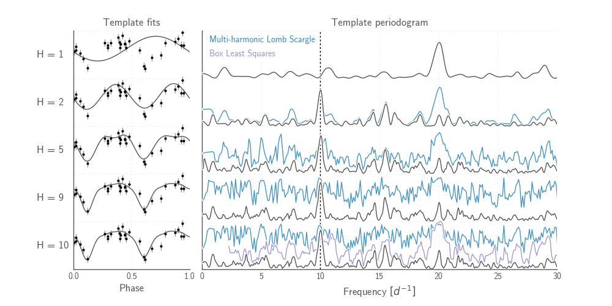
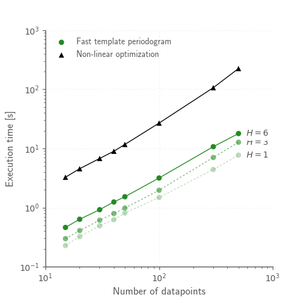
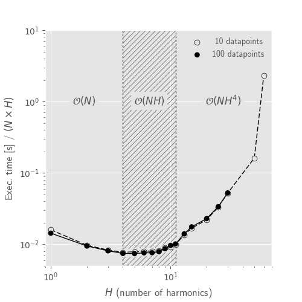
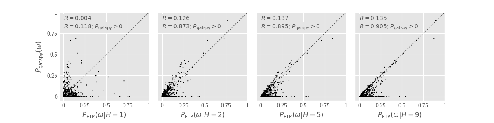
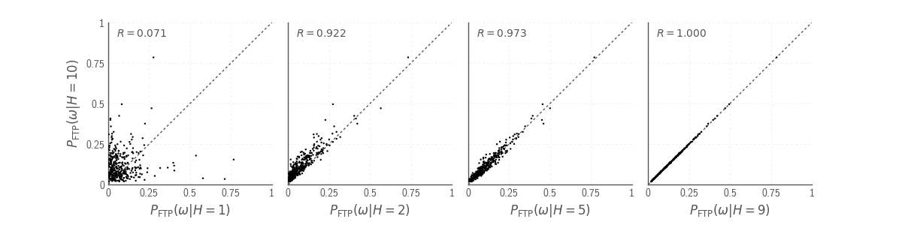

# Fast Template Periodogram [](https://travis-ci.org/PrincetonUniversity/FastTemplatePeriodogram) [](https://codecov.io/gh/PrincetonUniversity/FastTemplatePeriodogram)

(c) 2016; John Hoffman, Jake Vanderplas

Description
-----------



The Fast Template Periodogram extends the Generalized Lomb-Scargle
periodogram ([Zechmeister and Kurster 2009](http://adsabs.harvard.edu/cgi-bin/bib_query?arXiv:0901.2573])) 
for arbitrary (periodic) signal shapes. A template is first approximated
by a truncated Fourier series of length `H`. The Non-equispaced Fast Fourier Transform
[NFFT](https://www-user.tu-chemnitz.de/~potts/nfft/) is used
to efficiently compute frequency-dependent sums.

The `ftperiodogram` library is complete with API documentation and consistency
checks using `py.test`.

Installing
----------

See the `CONDA_INSTALL.md` for installing `ftperiodogram` with 
[`conda`](https://www.continuum.io/downloads)) (recommended).

Examples
--------

See the `Examples.ipynb` located in the `notebooks/` directory.

To run this notebook, use the `jupyter notebook` command from
inside the `notebooks/` directory

```
$ cd notebooks/
$ jupyter notebook
```

Updates
-------

* See the [issues](https://github.com/PrincetonUniversity/FastTemplatePeriodogram/issues) 
section for known bugs! You can also submit bugs through this interface.


More information
----------------


### Older methods

The [gatspy](http://www.astroml.org/gatspy/) library has an implementation of
both single and multiband template fitting, however this implementation
uses non-linear least-squares fitting to compute the optimal parameters 
(amplitude, phase, constant offset) of the template fit at each frequency. That
process scales as `N_obs*N_f`, where `N` is the number of observations and
`N_f` is the number of frequencies at which to calculate the periodogram.

This process is extremely slow. [Sesar et al. (2016)](https://arxiv.org/abs/1611.08596) applied a similar
template fitting procedure to multiband Pan-STARRS photometry and found that
(1) template fitting was significantly more accurate for estimating periods
of RR Lyrae stars, but that (2) it required a substantial amount of 
computational resources to perform these fits.

### How do we speed this up?

* The non-equispaced fast Fourier transform (NFFT)
* Polynomial zero-finding

The FTP is a non-linear extension of the GLS. The nonlinearity
of the problem can be reduced to finding the zeros of 
an order `~6H` polynomial at each trial frequency.

Templates must be well-approximated by a short truncated Fourier series 
of length `H`. Using this representation, the optimal parameters 
(amplitude, phase, offset) of the template fit at a given trial frequency
can then be found *exactly* after finding the roots of 
a polynomial at each trial frequency.

The coefficients of these polynomials involve sums that can be efficiently
computed with (non-equispaced) fast Fourier transforms. These sums
can be computed in `HN_f log(HN_f)` time.

In its current state, the root-finding procedure is the rate limiting step.
This unfortunately means that for now the fast template periodogram scales as 
`N_f*(H^4)`. We are working to reduce the computation time so that the entire 
procedure scales as `HN_f log(HN_f)` for reasonable values of `H` (`< 10`).

However, even for small cases where `H=6` and `N_obs=10`, this procedure is 
about twice as fast as the `gatspy` template modeler. And, the speedup over
`gatspy` grows linearly with `N_obs`! 


### How is this different than the multi-harmonic periodogram?

The multi-harmonic periodogram ([Schwarzenberg-Czerny (1996)](http://iopscience.iop.org/article/10.1086/309985/meta)) is another 
extension of Lomb-Scargle that fits a truncated Fourier series to the data 
at each trial frequency. This is nice if you have a strong non-sinusoidal signal 
and a large dataset. This algorithm can also be made to scale as
`HN_f logHN_f` ([Palmer 2009](http://iopscience.iop.org/article/10.1088/0004-637X/695/1/496/meta)).

However, the multi-harmonic periodogram is fundamentally different than template fitting. 
In template fitting, the relative amplitudes and phases of the Fourier series are *fixed*. 
In a multi-harmonic periodogram, the relative amplitudes and phases of the Fourier series are 
*free parameters*. These extra free parameters mean that (1) you need a larger
number of observations `N_obs` to reach the same signal to noise, and (2) you are
more likely to detect a multiple of the true frequency. For a discussion of this
effect, possible remedies with Tikhonov regularization, and an illuminating review
of periodograms in general, see [Vanderplas et al. (2015)](http://adsabs.harvard.edu/abs/2015ApJ...812...18V).

### Timing



The Fast Template Periodogram seems to do better than Gatspy
for virtually all reasonable cases (reasonable meaning a small-ish
number of harmonics are needed to accurately approximate the template,
small-ish meaning less than about 10).

It may be surprising that FTP appears to scale as `NH`, instead of
`NH log NH`, but that's because the NFFT is not the limiting factor (yet).
Most of the computation time is spent calculating polynomial coefficients,
and this computation scales as roughly `NH^4`. 



The FTP scales sub-linearly to linearly with the number of harmonics `H`
for `H < 10`, and for larger number of harmonics scales as `H^4`. This
is the main limitation of FTP.

### Accuracy

Compared with the Gatspy template modeler, the FTP provides improved accuracy as well as speed. 
For large values of `p(freq)`, the FTP correlates strongly with the Gatspy template algorithm; however,
since Gatspy uses non-linear function fitting (Levenberg-Marquardt), the predicted value for
`p(freq)` may not be optimal if the data is poorly modeled by the template. FTP, on the other 
hand, solves for the optimal solution directly, and thus tends to find equally good or 
better solutions when `p(freq)` is small.




For some frequencies, the Gatspy modeler finds no improvement over a constant fit 
(`p_gatspy(freq) = 0`). However, for these frequencies, the FTP consistently finds better 
solutions.

At frequencies where the template models the data at least moderately well (`p(freq) ~> 0.01`),
the Gatspy modeler and the FTP are in good agreement.

Assuming, then, that the FTP is indeed producing the "correct" periodogram, we can then
ask how many harmonics we must use in order to achieve an estimate of the periodogram to
a given accuracy.

TODO
----

* Multi-band extensions
* Speed improvements
