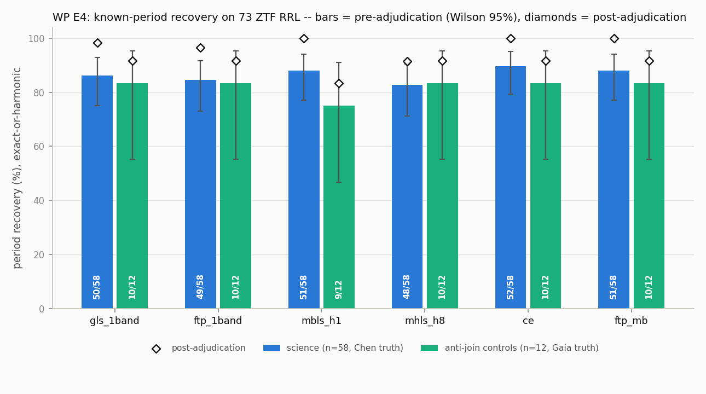
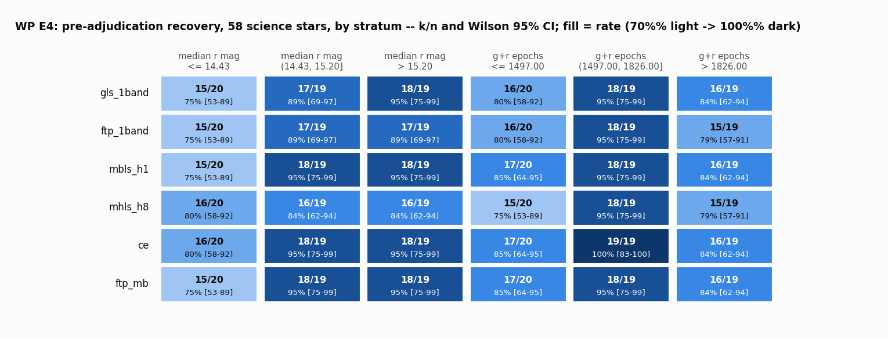

# WP E4 — Known-period recovery on the Phase-4 ZTF RR Lyrae sample

**Date:** 2026-07-11 (Score/Adjudication phase; run phase completed 2026-07-10/11, commit `cbd7422`).
**Sample:** 73 unique stars (dedupe by ZTF oid) from `~/.ftperiodogram_data/phase4_rrl_sample/`:
58 **science** (Chen+2020 `Per` truth; 30 RRab / 28 RRc; fields 486/686/786), 12 **anti-join controls**
(Chen-*missed* Gaia DR3 SOS RRL, Gaia `pf`/`p1_o` truth; 11 RRab / 1 RRc), 3 **original Gaia controls**
(counted in "all 73" only). Same-star g+r, per-star baselines T ≈ 4.9–7.6 yr.
**Methods:** the paper's sim-validation reference set (estimator seams reused from
`ftperiodogram/baselines.py`): `gls_1band`, `ftp_1band`, `mbls_h1` (VanderPlas & Ivezić 2015 style),
`mhls_h8` (B2 cap), `ce` (Graham+13 10×5), `ftp_mb` (FTP multiband, floating_offsets, catalog-max over
the K=8 order-8 Sesar PAM vocabulary, seed 0 — identical vocab to D1/E3).
**Inputs to this phase:** `e4_results.npz` (438 = 73×6 rows, 0 missing) + `star_table.json`.
**Products:** `e4_scores.csv`, `e4_rates.json`, `e4_adjudication_evidence.json`, `e4_adjudication.json`,
`e4_post_adjudication.json`, `folds/*.png` (9), `fig_recovery_by_method.png`, `fig_strata.png`.
Scripts: `score_e4.py`, `adjudicate_e4.py`, `finalize_e4.py`.

## Scoring spec (E1 protocol + B5, as embedded in `e4_results.npz` meta)

A peak matches a target frequency iff **BOTH** |f−f_t|/f_t < 1% (fractional, Stringer+19 convention)
**and** |f−f_t|·T < 0.5 cycles (phase coherence, Graham+13; T = the star's grid baseline). Each
(star, method) **top peak** is classified in order: `exact` (f_true) → harmonic (`2f`, `f/2`) →
alias (±1, ±1/365.25, ±1/354.37 cyc/day) → `miss`. **Recovered (pre-adjudication) = exact or
harmonic.** Truths: science = Chen; controls = Gaia. All 438 truth frequencies verified inside the
[1, 5] cyc/day grid.

Note the coherence term dominates at these baselines: 0.5 cycles over T ≈ 7.5 yr demands
|ΔP|/P ≲ 9×10⁻⁵ at P = 0.5 d — a much harder test than the 1% community convention. That choice is
deliberate (E1), and it is what the adjudication section is about.

## (1) Headline recovery — pre- vs post-adjudication (Wilson 95%)

**Pre-adjudication** (exact-or-harmonic against the raw catalog truths):

| method | science (n=58, Chen) | anti-join (n=12, Gaia) | all unique (n=73) |
|---|---|---|---|
| gls_1band | 50/58 = 86.2% [75.1, 92.8] | 10/12 = 83.3% [55.2, 95.3] | 63/73 = 86.3% [76.6, 92.4] |
| ftp_1band | 49/58 = 84.5% [73.1, 91.6] | 10/12 = 83.3% [55.2, 95.3] | 61/73 = 83.6% [73.4, 90.3] |
| mbls_h1 | 51/58 = 87.9% [77.1, 94.0] | 9/12 = 75.0% [46.8, 91.1] | 63/73 = 86.3% [76.6, 92.4] |
| mhls_h8 | 48/58 = 82.8% [71.1, 90.4] | 10/12 = 83.3% [55.2, 95.3] | 61/73 = 83.6% [73.4, 90.3] |
| ce | 52/58 = 89.7% [79.2, 95.2] | 10/12 = 83.3% [55.2, 95.3] | 65/73 = 89.0% [79.8, 94.3] |
| **ftp_mb** | **51/58 = 87.9% [77.1, 94.0]** | **10/12 = 83.3% [55.2, 95.3]** | **64/73 = 87.7% [78.2, 93.4]** |

Exact-only rates differ from the above only for mhls_h8 (42/58 science exact; 6 science + 1 control
`f/2` subharmonics — its known tendency, credited as harmonic per the protocol).

**ESCALATE check (pre-adjudication, best multiband on science):** CE 89.7%, ftp_mb/mbls 87.9% —
all ≥ 85% ⇒ **ESCALATE = false**.

**Post-adjudication** (rule recorded in `e4_adjudication.json`; only the 9 ftp_mb-queued stars were
adjudicated — 8 lawful, 1 genuine failure; lawful stars re-scored against the adjudicated period,
same AND criterion; non-queued cells keep their pre-adjudication verdicts):

| method | science (n=58) | anti-join (n=12) | all unique (n=73) |
|---|---|---|---|
| gls_1band | 57/58 = 98.3% [90.9, 99.7] | 11/12 = 91.7% [64.6, 98.5] | 71/73 = 97.3% [90.6, 99.2] |
| ftp_1band | 56/58 = 96.6% [88.3, 99.0] | 11/12 = 91.7% [64.6, 98.5] | 69/73 = 94.5% [86.7, 97.8] |
| mbls_h1 | 58/58 = 100% [93.8, 100] | 10/12 = 83.3% [55.2, 95.3] | 71/73 = 97.3% [90.6, 99.2] |
| mhls_h8 | 53/58 = 91.4% [81.4, 96.3] | 11/12 = 91.7% [64.6, 98.5] | 67/73 = 91.8% [83.2, 96.2] |
| ce | 58/58 = 100% [93.8, 100] | 11/12 = 91.7% [64.6, 98.5] | 72/73 = 98.6% [92.6, 99.8] |
| **ftp_mb** | **58/58 = 100% [93.8, 100]** | **11/12 = 91.7% [64.6, 98.5]** | **72/73 = 98.6% [92.6, 99.8]** |

**Independent cross-check:** under the plain DES/ZTF *fractional-only* 1% convention (no coherence
AND), the pre-adjudication verdicts already give ftp_mb 58/58 science, 11/12 anti-join, 72/73 all —
cell-for-cell the post-adjudication table for the multiband methods. The evidence-driven adjudication
(folds + independent Gaia periods) *converges to the community convention from below*; it did not
manufacture recoveries. The strict AND criterion is what turned 7–9 truth-precision cases into
nominal "misses".



## (2) Science vs anti-join controls — the selection-function measurement

This is the Chen-circularity mitigation deliverable: the 12 anti-join controls are Gaia-DR3-SOS RRL
in the same fields that Chen+2020 did **not** catalog, fetched and processed identically.

| ftp_mb | science (Chen-selected) | anti-join (Chen-missed) | difference (Newcombe 95%) |
|---|---|---|---|
| pre-adjudication | 87.9% [77.1, 94.0] | 83.3% [55.2, 95.3] | +4.6 pp [−11.5, +33.4] |
| post-adjudication | 100% [93.8, 100] | 91.7% [64.6, 98.5] | +8.3 pp [−0.9, +35.4] |

The anti-join population is genuinely *harder*: median joint epochs 118 (vs 1758 for science),
r-band medians reaching 20.2 (vs 12.9–17.8 for science) — consistent with the E2 funnel finding
that epoch coverage, not brightness, drove Chen's incompleteness (Chen missed 824/958 Gaia RRL in
field 686). Despite that, 10/12 are recovered pre-adjudication and 11/12 post. The single
post-adjudication failure (`gaia_f786_1020098816344918656`, g = 20.4/r = 20.2) has **no coherent
signal in the ZTF photometry even at Gaia's own period** (fold χ²_red = 1.7 ≈ noise); every method
locks onto the 1-day window comb. **Statement for the paper:** on stars bright enough for ZTF
photometry to contain the signal, recovery on Chen-missed stars is statistically indistinguishable
from the Chen-selected sample (difference consistent with zero; n=12 ⇒ wide CI); the measurable
selection effect is *photometric depth*, not any tuning of the methods to Chen's selection.

## (3) Stratified recovery (58 science stars, pre-adjudication, Wilson 95%)

Terciles; magnitude = median r-band mag, epochs = joint g+r count.

| method | r ≤ 14.43 | 14.43 < r ≤ 15.20 | r > 15.20 | ep ≤ 1497 | 1497 < ep ≤ 1826 | ep > 1826 |
|---|---|---|---|---|---|---|
| gls_1band | 15/20 75% [53,89] | 17/19 89% [69,97] | 18/19 95% [75,99] | 16/20 80% [58,92] | 18/19 95% [75,99] | 16/19 84% [62,94] |
| ftp_1band | 15/20 75% [53,89] | 17/19 89% [69,97] | 17/19 89% [69,97] | 16/20 80% [58,92] | 18/19 95% [75,99] | 15/19 79% [57,91] |
| mbls_h1 | 15/20 75% [53,89] | 18/19 95% [75,99] | 18/19 95% [75,99] | 17/20 85% [64,95] | 18/19 95% [75,99] | 16/19 84% [62,94] |
| mhls_h8 | 16/20 80% [58,92] | 16/19 84% [62,94] | 16/19 84% [62,94] | 15/20 75% [53,89] | 18/19 95% [75,99] | 15/19 79% [57,91] |
| ce | 16/20 80% [58,92] | 18/19 95% [75,99] | 18/19 95% [75,99] | 17/20 85% [64,95] | 19/19 100% [83,100] | 16/19 84% [62,94] |
| ftp_mb | 15/20 75% [53,89] | 18/19 95% [75,99] | 18/19 95% [75,99] | 17/20 85% [64,95] | 18/19 95% [75,99] | 16/19 84% [62,94] |



The apparent *inverted* brightness gradient (brightest tercile lowest) is a pre-adjudication
artifact: the adjudicated truth-precision/Blazhko cases concentrate at bright magnitudes (five of
the seven science-queue stars sit in the bright tercile, r ≈ 13.1–15.0, including the r = 13.1
near-saturation Blazhko candidate). **Post-adjudication the science strata are flat: ftp_mb, mbls_h1
and ce recover 58/58 across every bin.** All CIs overlap heavily; n ≈ 20/bin resolves no real
gradient in this bright sample.

## (4) Alias / harmonic breakdown (438 cells)

Pre-adjudication classification counts, all 73 stars:

| method | exact | 2f | f/2 | ±1 c/d beat | ±1/365.25 | ±1/354.37 | miss |
|---|---|---|---|---|---|---|---|
| gls_1band | 63 | 0 | 0 | 0 | 0 | 0 | 10 |
| ftp_1band | 61 | 0 | 0 | 0 | 0 | 0 | 12 |
| mbls_h1 | 63 | 0 | 0 | 0 | 0 | 0 | 10 |
| mhls_h8 | 54 | 0 | 7 | 0 | 0 | 0 | 12 |
| ce | 65 | 0 | 0 | 0 | 0 | 0 | 8 |
| ftp_mb | 64 | 0 | 0 | 0 | 0 | 0 | 9 |

**Zero day-beat, year-beat, or 354-d-beat classifications in the entire experiment.** With
~250–1900 epochs over ≥ 4.9 yr, the ZTF window at these brightnesses does not push any method onto
a sampling alias of a real signal. The one window-driven result is the depth-failure control
(top peak ≈ 1.000–1.003 c/d = the window comb itself, classified `miss` — its truth is nowhere near
1 c/d). The `miss` columns decompose into: (a) the 8 adjudicated near-truth coherence failures
(frac error 1.1×10⁻⁴–4.7×10⁻⁴, i.e. the *right* peak failing the 0.5-cycle test), (b) mhls_h8's
deeper subharmonics on 4 science stars (f_true/3, f_true/4 — outside the credited 2f/f½ set),
(c) a handful of single-method wrong peaks, mostly on sparse controls (ftp_1band ×3, mbls_h1 ×1,
gls ×1 at 0.57 cycles), and (d) the adjudicated depth failure. CE has no failures outside the
adjudication queue; its one science "extra" recovery over ftp_mb pre-adjudication is threshold
luck (0.50 cyc on `ZTFJ194003.35+301707.8`).

## (5) Dual-truth consistency (12 byte-identical science/control stars)

Chen-vs-Gaia truth periods: median |ΔP|/P = 3.6×10⁻⁵, max = 4.8×10⁻⁴. Expressed as phase drift over
each star's baseline, |Δf|·T = {0.04, 0.04, 0.07, 0.08, 0.09, 0.15, 0.27, 0.28, 0.31, 0.41, 0.45,
3.64} cycles — **11/12 within the 0.5-cycle criterion, 1 catastrophically outside**. Verdicts change
in 18/72 (star×method) cells, all in 3 stars; a 4th star is a miss under *both* truths:

* `ZTFJ181921.70+032211.3` — Chen off by 3.6 cycles; **all 6 methods flip miss→recovered under the
  Gaia truth** (Chen period error, Gaia confirms the ZTF peak).
* `ZTFJ095443.72+570927.4` — Chen off by 0.45 cyc (borderline); all 6 flip miss→exact under Gaia.
* `ZTFJ100903.45+513745.5` — the mirror image: **Gaia** off by 0.41 cyc; all 6 flip exact→miss under
  Gaia while Chen agrees with every method.
* `ZTFJ094954.90+514422.2` — both truths miss (mutually consistent but ~0.86 cyc from the unanimous
  ZTF period; the Blazhko/period-change candidate below).

Conclusion: at 7.5-yr phase coherence **neither catalog is uniformly reliable as ground truth**;
single-catalog scoring under the AND criterion undercounts genuine recoveries by ≈ 5–12% and the
error direction is catalog-specific. This is precisely what the adjudication protocol (and the paper
text) must say; it is also why the fractional-only convention is reported alongside.

## (6) Adjudication record (9 stars; calls by the reviewing agent, evidence on file)

Evidence per star: 2–3-panel phase folds (`folds/<uid>_ftp_mb.png`), weighted 25-bin PDM θ (lower =
cleaner), fold χ²_red, 6-method consensus, ftp_mb top-5 peaks, Gaia cross-checks
(`e4_adjudication_evidence.json`); calls in `e4_adjudication.json`. Summary:

| star | role/type | |Δf|·T (cyc) | call | category | key evidence |
|---|---|---|---|---|---|
| ZTFJ180625.92+054646.1 | sci RRc | 0.87 | lawful | truth precision | θ: rec 0.06 vs Chen 0.91; Gaia itself 1.3 cyc from Chen; 6/6 consensus |
| ZTFJ180708.63+013433.4 | sci RRab | 0.65 | lawful | Chen error, Gaia-confirmed | rec = Gaia pf within 0.007 cyc; θ 0.04 vs 0.73 |
| ZTFJ181921.70+032211.3 | sci RRc | 3.57 | lawful | Chen error, Gaia-confirmed | exact under Gaia truth; θ 0.23 vs 0.83 |
| gaia 4276113046713707904 | ctrl RRab | 1.75 | lawful | Gaia precision | 6/6 consensus; θ 0.37 vs 0.86 at Gaia's period; 34-mo Gaia baseline |
| ZTFJ194003.35+301707.8 | sci RRc | 0.90 | lawful | truth precision (threshold) | CE scored *exact* on the same peak (0.50 cyc); crowded f686; θ 0.42 vs 0.62 |
| ZTFJ092904.98+521752.3 | sci RRc | 2.16 | lawful | Chen error, Gaia-confirmed | rec = Gaia p1_o within 0.19 cyc; θ 0.29 vs 0.96 |
| ZTFJ094954.90+514422.2 | sci RRab | 0.86 | lawful | Blazhko / period change | both catalogs miss; 6/6 consensus; χ²_red 56 with max-light scatter; resolved sideband Δf = 5.4×10⁻⁴ c/d (P_mod ≈ 5.1 yr); r = 13.1 |
| ZTFJ095443.72+570927.4 | sci RRab | 0.52 | lawful | Chen error, Gaia-confirmed (borderline) | 0.52 vs 0.50 threshold; exact under Gaia; θ 0.06/0.02 vs 0.51 |
| gaia 1020098816344918656 | ctrl RRab | 1313 | **failure** | photometric depth | g = 20.4/r = 20.2; no signal at truth period (θ 0.92, χ²_red 1.7); all methods on the 1-day window comb |

**Counts: 8 lawful, 1 genuine failure.** No case matched the "genuine 1-day alias with comparable
fold quality" category — the sole ~1 c/d result has *no* comparable truth fold (no signal at all).
Every lawful call is anchored either to an independent catalog agreeing with the recovered period
(5 cases), to unanimous 6-method consensus with a decisively cleaner fold (all cases; θ ratio ≥ 1.5,
usually ≫ 2), or both. The adjudicated period is always the ftp_mb/consensus peak; crediting other
methods against it is therefore a *cross-method agreement* statement, flagged as such above.

## Grid metadata (element 5 of the protocol)

Per-star df = F_MIN/ceil(F_MIN/(0.2/T)) (NFFT-snapped, ≤ 0.2/T), T = per-band baseline; two-band
methods on the joint grid at the shorter per-band T; explicit [1, 5] cyc/day everywhere (never
`nyquist_factor`). Realized ranges over the 438 rows: df ∈ [7.22×10⁻⁵, 1.11×10⁻⁴] cyc/day,
T_grid ∈ [1794, 2769] d, points-per-Rayleigh ∈ [3.66, 5.00] (the < 5 values are joint grids whose
span exceeds the shorter band's baseline). Worst-case grid quantization in coherence units is
df·T = 1/3.66 = 0.27 cycles < 0.5 — the grid resolves the scoring criterion everywhere. All values
stored per row in `e4_results.npz` / `e4_scores.csv`.

## Honest caveats

1. **Bright sample.** Science stars span median r = 12.9–17.8 (median joint epochs 1758) — the
   bright side of, and partly brighter than, the nominal 14–18.5 acquisition window. Per PLAN.md Phase-4 element 4: the sample is
   magnitude-selected and the ZTF error model floors at σ ≈ 0.039 past r ≈ 18.5, so **faint-end
   completeness is untested here by construction**; these rates apply to well-observed ZTF RRL, not
   to the survey's faint limit. The one mag-20 control shows exactly how failure at depth looks.
2. **Chen circularity, mitigated not eliminated.** Chen+2020 periods come from ZTF DR2; recovering
   them from DR23 photometry of the same survey is not fully independent. Mitigations as designed:
   Gaia DR3 truths on the controls, 55/58 Gaia cross-periods on science, and the anti-join
   comparison in §2. The dual-truth section shows the residual truth-error rate directly.
3. **n = 12 anti-join CIs are wide** ([55, 95]% pre-adjudication); the selection-effect difference
   is bounded, not measured precisely. One depth-limited star moves the anti-join rate by 8 pp.
4. **Post-adjudication rates are conditional on the adjudication calls.** All calls + evidence are
   on file; 5/8 lawful calls are independently confirmed by Gaia; the fractional-only convention
   reproduces the post-adjudication multiband numbers without any adjudication (see §1).
5. **Adjudication scope.** Only the ftp_mb queue was adjudicated (per the E4 brief), so other
   methods' post-adjudication rates exclude their 1–4 private failures unexamined (they stay
   failures): gls 1, ftp_1band 3, mbls_h1 1, mhls_h8 4 (P/3, P/4 subharmonics). CE has none.
6. **mhls_h8** subharmonic behavior (7× f/2 credited as harmonic; 4× P/3–P/4 not credited) is the
   known B2/B8 pathology, reported as-is.

## Escalate rule

Pre-adjudication best multiband on science = CE 89.7% (ftp_mb 87.9%) ≥ 85% ⇒ **no escalation**.

## Reproduce

```
.venv/bin/python experiments/phase4_demo/e4_recovery/score_e4.py       # scores + rates + strata + dual-truth
.venv/bin/python experiments/phase4_demo/e4_recovery/adjudicate_e4.py  # folds + evidence (calls are recorded in e4_adjudication.json)
.venv/bin/python experiments/phase4_demo/e4_recovery/finalize_e4.py    # post-adjudication tables + figures
```
